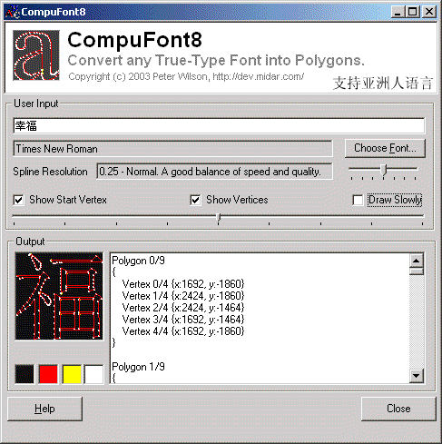



## Convert Fonts to Vector Graphics using GetGlyphOutline

### Description

This application can convert any True-Type Font into a series of polygons made entirely of straight lines defined by vertices. Possible Uses: Create your own 3D font applications ala "Xara 3D" style. Design assistance with large signs, corporate logos or banners. Create vector-style game graphics based on exotic fonts (ie. Wingdings)
 
### More Info
 

             |
---                |---
**Submitted On**   |2003-12-02 00:49:14
**By**             |[Peter Wilson](https://github.com/Planet-Source-Code/PSCIndex/blob/master/ByAuthor/peter-wilson.md)
**Level**          |Intermediate
**User Rating**    |5.0 (120 globes from 24 users)
**Compatibility**  |VB 6\.0
**Category**       |[Graphics](https://github.com/Planet-Source-Code/PSCIndex/blob/master/ByCategory/graphics__1-46.md)
**World**          |[Visual Basic](https://github.com/Planet-Source-Code/PSCIndex/blob/master/ByWorld/visual-basic.md)
**Archive File**   |[Convert\_Fo1682101292003\.zip](https://github.com/Planet-Source-Code/peter-wilson-convert-fonts-to-vector-graphics-using-getglyphoutline__1-50004/archive/master.zip)

